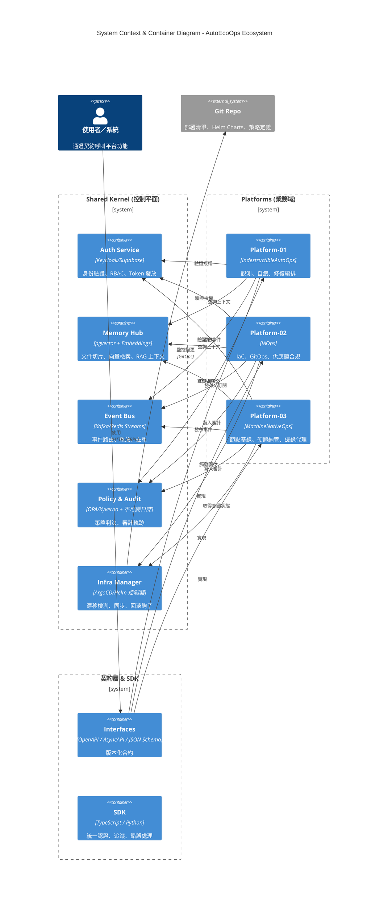
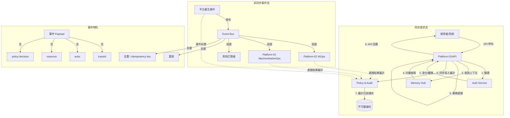
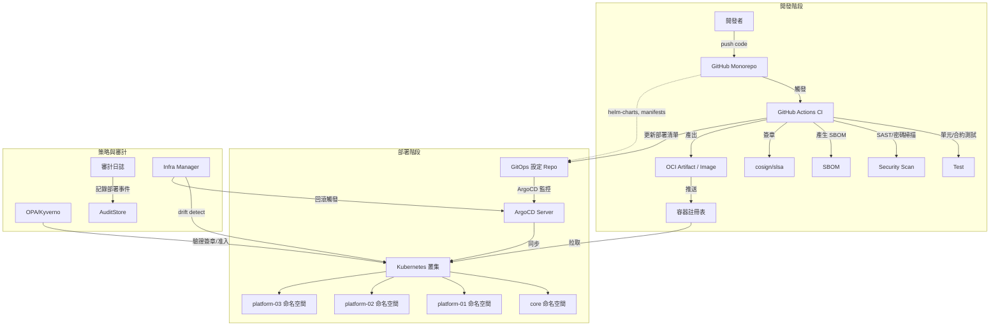

# AutoEcoOps Ecosystem Architecture Design

## 1. 系統上下文與容器架構 (System Context & Container Diagram)

AutoEcoOps 是一個企業級自動化維運與生態系統平台，旨在透過高度自動化、零人類介入的流程，實現軟體生命週期的全面管理。系統架構基於領域驅動設計 (DDD)，將核心控制平面與業務平台分離，確保高可用性、安全合規與可擴展性。

### 1.1 核心架構圖

## 2. 核心工作流程 (Core Workflows)

### 2.1 同步請求與非同步事件流

### 2.2 CI/CD 與 GitOps 部署流程

## 3. 企業級核心能力規範

| 領域 | 規範與實作要求 |
| :--- | :--- |
| **身分與授權** | - 統一使用 OIDC 聯盟（Keycloak/Supabase） - RBAC 權限模型集中定義，平台僅讀取決策 - 所有 API 請求必須通過 JWT 驗證，並綁定 traceId / sessionId |
| **可觀測性** | - 結構化日誌強制包含 timestamp, traceId, spanId, service, platformId, action, decision - 指標曝露符合 OpenMetrics，SLO 定義：可用性 ≥99.99%、P95 延遲 ≤200ms、錯誤率 ≤0.1% - 分散式追蹤取樣率 100% 儲存關鍵路徑 |
| **合規審計** | - 所有審計日誌儲存於不可變儲存（Object Lock / Append‑only 資料庫） - 審計事件必須包含：操作人、資源、動作、結果、策略版本、合規標籤 - 提供合規報表自動生成介面（SOC2、ISO27001 就緒） |
| **供應鏈安全** | - 達到 SLSA Build Level 3：建置流程隔離、產出摘要簽章、可重現建置 - 每個 artifact 必須附 SBOM（CycloneDX）並簽署（cosign） - 部署前須通過政策驗證：簽章有效、漏洞掃描無高風險、SBOM 授權合規 |
| **災備與彈性** | - 支援多集群部署（Active‑Active / Active‑Standby） - 跨區域複製審計資料與事件流 - 定義 RPO ≤ 1 小時，RTO ≤ 15 分鐘 |

## 4. 共享內核（控制平面）強化規範

所有 `core/*` 服務須滿足：高可用、橫向擴展、版本化介面、安全預設。

### 4.1 auth-service（身分代理）
- 對外提供 OIDC Discovery Endpoint
- 內部 RBAC 規則由 policy-audit 定期同步，不儲存業務權限
- 必須支援 API 金鑰輪換與撤銷清單（CRL）

### 4.2 memory-hub
- 文件入庫前必須掃毒（ClamAV）
- 向量嵌入模型版本固定，切換版本需審計記錄
