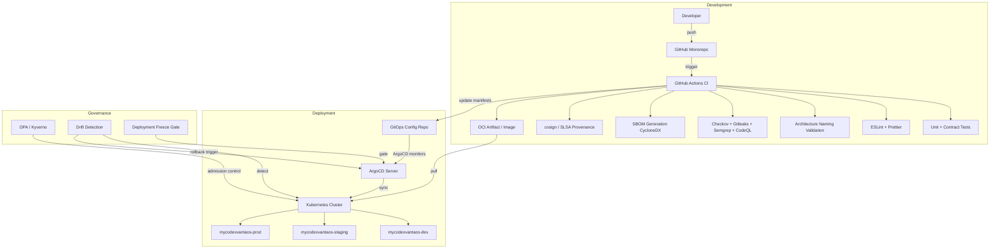

# MyCodexVantaOS — Platform Architecture Design

> **Platform Root Monorepo** · Version 1.0.0  
> Organization: `mycodexvantaos` · NPM Scope: `@mycodexvantaos` · URN Namespace: `urn:mycodexvantaos`

---

## 1. Platform Overview

**MyCodexVantaOS** is an enterprise-grade, cloud-agnostic, AI-native operating system platform. It is designed as a modular monorepo that combines an AI Team Orchestration system, a Persona Engine, a multi-provider infrastructure layer, and a governance-driven naming specification — all unified under a single coherent platform identity.

The platform's core mission is to enable developers and AI agents to build, deploy, and manage modern applications with maximum observability, governance compliance, and operational excellence. It follows a **local-first, quantum-aware** design philosophy, ensuring portability across cloud providers and on-premise environments.

### Platform Identity

| Attribute | Value |
| :--- | :--- |
| Organization | `mycodexvantaos` |
| NPM Scope | `@mycodexvantaos` |
| URN Namespace | `urn:mycodexvantaos` |
| Kubernetes API Group | `mycodexvantaos.quantum` |
| Primary Language | TypeScript (89%) |
| Secondary Languages | Python, Shell, OPA |
| Version | 1.0.0 |

---

## 2. Six-Layer Architecture

MyCodexVantaOS is organized into six distinct architectural layers, each with clearly defined responsibilities and inter-layer contracts.

```
┌─────────────────────────────────────────────────────────────────┐
│                    MyCodexVantaOS Platform                      │
├─────────────────────────────────────────────────────────────────┤
│  Layer A — Application Layer                                    │
│  Builder · UI Generator · App Dev Studio (MyCodeXvantaOS Studio)    │
├─────────────────────────────────────────────────────────────────┤
│  Layer B — Runtime & Execution Layer                            │
│  Runtime · Execution Engine · Background Job Runtime           │
├─────────────────────────────────────────────────────────────────┤
│  Layer C — Native Services Layer                                │
│  Auth · Config · Database · Storage · Secrets · Observability   │
│  Event Bus · Logging · Validation · Queue · SSL Manager        │
├─────────────────────────────────────────────────────────────────┤
│  Layer D — Connector Layer                                      │
│  connector-github · connector-kafka · connector-mongodb         │
│  connector-postgresql · connector-redis · connector-s3          │
│  connector-elastic · connector-auth                             │
├─────────────────────────────────────────────────────────────────┤
│  Layer E — Deployment Layer                                     │
│  Deployment Engine · Manifest Generator · ArgoCD GitOps         │
│  Kubernetes (base + overlays) · Helm Charts                     │
├─────────────────────────────────────────────────────────────────┤
│  Layer F — Governance Layer                                     │
│  Naming Policy · Service Manifest · Architecture Validation     │
│  Capability Set · Provider Registry · URN Registry             │
└─────────────────────────────────────────────────────────────────┘
```

### Layer Summary

| Layer | Name | Key Components | Responsibility |
| :---: | :--- | :--- | :--- |
| **A** | Application | `builder`, `ui-generator`, `app-dev-studio` | User-facing application generation and studio tooling |
| **B** | Runtime & Execution | `runtime`, `execution`, `background-job-runtime` | Multi-environment execution, job scheduling |
| **C** | Native Services | `core-auth`, `core-kernel`, `core-gateway`, `core-config`, `database`, `storage`, `events`, `native-logging` | Platform-level infrastructure primitives |
| **D** | Connector | `connector-github`, `connector-kafka`, `connector-mongodb`, `connector-postgresql`, `connector-redis`, `connector-s3` | External system integrations |
| **E** | Deployment | `deployment`, `deployment-manifest-generator`, ArgoCD, Helm | GitOps-driven deployment orchestration |
| **F** | Governance | `governance-policy`, `ci/validate-architecture.ts`, naming-spec-v1 | Naming enforcement, compliance, audit |

---

## 3. AI Core Modules

The AI subsystem is the platform's primary differentiator, consisting of two flagship modules and a supporting set of AI packages.

### 3.1 AI Team Orchestrator (`mycodexvantaos-ai-team-orchestrator`)

The AI Team Orchestrator manages multi-agent collaboration, task decomposition, workflow execution, and governance enforcement. It coordinates specialized AI agents with distinct archetypes and routes tasks through a structured workflow engine.

```
modules/mycodexvantaos-ai-team-orchestrator/
└── src/core/
    ├── agent-manager.ts        # Agent registration and lifecycle
    ├── message-bus.ts          # Inter-agent communication
    ├── orchestrator.ts         # Central coordination engine
    ├── task-decomposer.ts      # Task breakdown and routing
    ├── team-manager.ts         # Team topology management
    ├── workflow-engine.ts      # Parallel/sequential execution
    └── governance-enforcer.ts  # Tiered governance with HITL checkpoints
```

### 3.2 Persona Engine (`mycodexvantaos-persona-engine`)

The Persona Engine implements intelligent AI personas with semantic mask detection, multi-layer root cause analysis, and solution generation. It provides 9 persona archetypes and 8 semantic mask detection types.

| Persona Archetype | Role |
| :--- | :--- |
| Disrupter | Challenges assumptions, proposes radical alternatives |
| Analyst | Data-driven pattern recognition and analysis |
| Critic | Identifies risks, weaknesses, and failure modes |
| Architect | System design and structural reasoning |
| Mediator | Conflict resolution and consensus building |
| Creative Thinker | Novel ideation and lateral thinking |
| Facilitator | Process guidance and team coordination |
| Mentor | Knowledge transfer and coaching |
| Synthesizer | Cross-domain integration and summarization |

### 3.3 AI Package Ecosystem

| Package | URN | Capability | Provider |
| :--- | :--- | :--- | :--- |
| `@mycodexvantaos/ai-embedding` | `urn:mycodexvantaos:manifest:service:mycodexvantaos-ai-embedding` | embedding, vector-store | OpenAI, pgvector |
| `@mycodexvantaos/ai-llm` | `urn:mycodexvantaos:manifest:service:mycodexvantaos-ai-llm` | llm | OpenAI, Gemini, Anthropic |
| `@mycodexvantaos/ai-memory` | `urn:mycodexvantaos:manifest:service:mycodexvantaos-ai-memory` | memory, vector-store | pgvector, Redis |
| `@mycodexvantaos/ai-agent` | `urn:mycodexvantaos:manifest:service:mycodexvantaos-ai-agent` | agent, llm, memory | multi-provider |

---

## 4. Core Services Catalog

The platform exposes 25+ services organized by domain. All services follow the naming convention `mycodexvantaos-<domain>-<capability>`.

### 4.1 Core Domain

| Service ID | Package | Lifecycle | Capabilities |
| :--- | :--- | :---: | :--- |
| `mycodexvantaos-core-kernel` | `@mycodexvantaos/core-kernel` | stable | database, cache, observability, secrets |
| `mycodexvantaos-core-auth` | `@mycodexvantaos/core-auth` | stable | auth, database, cache, secrets |
| `mycodexvantaos-core-gateway` | `@mycodexvantaos/core-gateway` | stable | auth, observability, cache |
| `mycodexvantaos-core-config` | `@mycodexvantaos/core-config` | stable | config, secrets |

### 4.2 AI Domain

| Service ID | Package | Lifecycle | Capabilities |
| :--- | :--- | :---: | :--- |
| `mycodexvantaos-ai-embedding` | `@mycodexvantaos/ai-embedding` | stable | embedding, vector-store, cache |
| `mycodexvantaos-ai-llm` | `@mycodexvantaos/ai-llm` | stable | llm, cache |
| `mycodexvantaos-ai-memory` | `@mycodexvantaos/ai-memory` | stable | memory, vector-store |
| `mycodexvantaos-ai-agent` | `@mycodexvantaos/ai-agent` | beta | agent, llm, memory |

### 4.3 Data Domain

| Service ID | Package | Lifecycle | Capabilities |
| :--- | :--- | :---: | :--- |
| `mycodexvantaos-data-graph` | `@mycodexvantaos/data-graph` | stable | graph, database |
| `mycodexvantaos-data-pipeline` | `@mycodexvantaos/data-pipeline` | stable | pipeline, storage |
| `mycodexvantaos-data-vector-store` | `@mycodexvantaos/data-vector-store` | stable | vector-store, database |
| `mycodexvantaos-docs-search` | `@mycodexvantaos/docs-search` | stable | search, embedding |

### 4.4 Platform Domain

| Service ID | Package | Lifecycle | Capabilities |
| :--- | :--- | :---: | :--- |
| `mycodexvantaos-platform-observability` | `@mycodexvantaos/platform-observability` | stable | observability, logging, metrics |
| `mycodexvantaos-platform-scheduler` | `@mycodexvantaos/platform-scheduler` | stable | scheduler, queue |
| `mycodexvantaos-platform-notification` | `@mycodexvantaos/platform-notification` | stable | notification, queue |
| `mycodexvantaos-governance-policy` | `@mycodexvantaos/governance-policy` | stable | policy, audit |

---

## 5. Provider System

The platform uses a multi-provider architecture that supports **Native**, **Connected**, and **Hybrid** modes, enabling cloud-agnostic deployments.

```
providers/
├── auth/          # auth-keycloak, auth-jwt-native, auth-supabase
├── cache/         # cache-redis, cache-memory-native
├── database/      # database-postgres, database-sqlite-native
├── embedding/     # embedding-openai, embedding-ollama, embedding-cohere
├── llm/           # llm-openai, llm-gemini, llm-anthropic, llm-ollama
├── vector-store/  # vector-store-pgvector, vector-store-qdrant
├── storage/       # storage-s3, storage-gcs, storage-local
├── observability/ # observability-opentelemetry, observability-prometheus
├── secrets/       # secrets-k8s-native, secrets-vault
└── graph/         # graph-neo4j, graph-native
```

### Deployment Modes

| Mode | Description | Use Case |
| :--- | :--- | :--- |
| **Native** | All services run locally without external dependencies | Development, air-gapped environments |
| **Connected** | Services connect to external cloud providers | Production cloud deployments |
| **Hybrid** | Mix of native and connected providers | Staging, cost-optimized production |

---

## 6. Naming Convention

All resources follow the `naming-spec-v1.md` specification, enforced by CI on every PR.

| Resource Type | Format | Example |
| :--- | :--- | :--- |
| Service ID | `mycodexvantaos-<domain>-<capability>` | `mycodexvantaos-ai-embedding` |
| Package Name | `@mycodexvantaos/<short-id>` | `@mycodexvantaos/ai-embedding` |
| URN | `urn:mycodexvantaos:manifest:service:<service-id>` | `urn:mycodexvantaos:manifest:service:mycodexvantaos-ai-embedding` |
| Env Var | `MYCODEXVANTAOS_<SUBSYSTEM>_<KEY>` | `MYCODEXVANTAOS_LLM_API_KEY` |
| K8s Namespace | `mycodexvantaos-<env>` | `mycodexvantaos-prod` |
| Provider Instance | `<capability>-<provider>` | `embedding-openai` |

### Naming Enforcement

| Enforcement Type | File | Trigger |
| :--- | :--- | :--- |
| Hard (blocks merge) | `ci/validate-architecture.ts` | Every PR |
| Legacy prefix scan | `scripts/check-legacy-prefix.sh` | Every PR |
| Manifest schema validation | `.github/workflows/validate-naming.yml` | Every PR |
| Exception expiry | `.github/workflows/expire-exceptions.yml` | Weekly (Monday) |

---

## 7. CI/CD & GitOps Pipeline



### Active GitHub Actions Workflows

| Workflow | Purpose |
| :--- | :--- |
| `unified-ci.yaml` | Main CI pipeline (lint, test, validate) |
| `unified-cd.yaml` | Continuous deployment pipeline |
| `security-scan.yaml` | Checkov + Trivy vulnerability scan |
| `provenance-attest.yaml` | SLSA Build Level 3 provenance attestation |
| `sbom-upload.yaml` | CycloneDX SBOM generation and upload |
| `drift-detection.yaml` | Configuration drift detection |
| `freeze-gate.yaml` | Deployment freeze gate enforcement |
| `opa-policy-check.yaml` | OPA policy compliance check |
| `contract-diff.yaml` | OpenAPI contract diff validation |
| `gitleaks.yaml` | Secret scanning |
| `codeql-analysis.yml` | Static code analysis |
| `validate-naming.yml` | Platform naming convention enforcement |

---

## 8. Vector Store & Knowledge Graph

### 8.1 Vector Collections

| Collection | Embedding Model | Dimensions | Use Case |
| :--- | :--- | :---: | :--- |
| `mycodexvantaos-ai-memory--memories` | bge-small | 384 | Agent short-term memory |
| `mycodexvantaos-ai-memory--sessions` | openai-text-embedding-3-small | 1536 | Session context |
| `mycodexvantaos-data-pipeline--artifacts` | ollama-nomic-embed-text | 768 | Pipeline artifacts |
| `mycodexvantaos-data-vector-store--datasets` | openai-text-embedding-3-large | 3072 | Large dataset embeddings |
| `mycodexvantaos-docs-search--chunks` | cohere-embed-english-v3 | 1024 | Documentation search |

### 8.2 Retrieval Pipelines

| Pipeline | Backend | Strategy |
| :--- | :--- | :--- |
| `retrieval--dense--pgvector` | pgvector | Dense vector similarity |
| `retrieval--hybrid--pgvector` | pgvector | Hybrid (dense + sparse) |
| `retrieval--dense--qdrant` | Qdrant | Dense vector similarity |
| `retrieval--hybrid--qdrant` | Qdrant | Hybrid (dense + sparse) |
| `retrieval--sparse--pgvector` | pgvector | Sparse BM25 |

---

## 9. Kubernetes Infrastructure

```
infra/
├── helm/mycodexvantaos/
│   ├── Chart.yaml
│   ├── values.yaml           # Base values
│   ├── values-dev.yaml       # Development overrides
│   ├── values-staging.yaml   # Staging overrides
│   └── values-prod.yaml      # Production overrides
├── kubernetes/
│   ├── base/kustomization.yaml
│   └── namespaces/
│       ├── mycodexvantaos-dev.yaml
│       ├── mycodexvantaos-staging.yaml
│       └── mycodexvantaos-prod.yaml
└── oci/
    ├── image-registry.yaml
    └── image-policies/prod-digest-pinning-policy.yaml
```

---

## 10. Implementation Status

| Phase | Status | Description |
| :--- | :---: | :--- |
| Phase 1 — Immediate Fixes | ✅ Complete | Symbol cleanup, test framework setup |
| Phase 2 — Core Implementation | ✅ Complete | Builder, Runtime, Deployment, Service Discovery |
| Phase 3 — Remaining Packages | ✅ Complete | All 27 packages implemented (100%) |
| Phase 4 — Testing | 🔄 In Progress | 98/99 test suites passing |
| Phase 5 — Production Hardening | 📋 Planned | Multi-cluster, DR, SLO enforcement |

**Test Coverage**: 98/99 test suites passing as of latest commit.

---

## 11. Quick Start

```bash
# Install dependencies
pnpm install

# Validate all naming (hard + soft enforcement)
pnpm validate

# Run tests
pnpm test

# Generate a new service scaffold
pnpm scaffold mycodexvantaos-ai-reasoning --capabilities=llm,embedding

# Start development server
pnpm dev

# Check for forbidden legacy prefixes
pnpm check-legacy

# Scan for naming drift
pnpm scan-drift
```

---

*Architecture document maintained by the MyCodexVantaOS platform team. Last updated: 2026-05-05.*
